

# Table of contents

* [Overview](#overview)
* [User Guide](#user-guide)
* [Milestones](#milestones)
* [Community Feedback](#community-feedback)
* [Our Team](#our-team)

# Welcome to Wonkes!!

Check out [Wonkes Market](https://wonkes.vercel.app/) to see what's there!

# Overview

At the end of every semester at the University of Hawai'i at Mānoa, the dorms come alive with move-out chaos. Students pack clothes, books, desktops, fans, things they can carry. But many larger or bulky items, like mini-fridges and TVs don't make the trip home. Perfectly usable furniture is thrown into dumpsters, and some left in hallways. Storage bins, mirrors, shelves, and other small items pile up outside the dorms. Where do these items end up? Maybe in a landfill, maybe recycled, maybe taken by someone walking by. We wondered: what if there was a quicker and simpler way for these items to find a new home? That idea became Wonkes Market.

Wonkes Market is an online marketplace designed for UH Mānoa students. Our goal is to make buying and selling campus-related items quicker and money-saving. Instead of throwing things away students can simply list them on Wonkes. Instead of spending money on new supplies next semester, students can find cheaper secondhand items from their dorm neighbors.

Wonkes Market is built as a simple, small web application using technologies widely used in today's software industry:

* [React](https://reactjs.org/) for component-based interactive UI implementation and routing.
* [React Bootstrap](https://react-bootstrap.github.io/) for beautiful but easy-to-make page and component layout.
* [Vercel](https://vercel.com/) for hosting service that deploys project online and hosts database.

With this tech stack, we made:

* A functioning landing page, a view listings page, a listing details page, an add listing page, an edit listing page.
* A user-friendly sign in page, a sign up page, a log out page, a change password page, and a reset forgotten password page.
* A surprising 404 not found page, a coming soon page.
* Interface built with boostrap 5 for a responsive and multi-platform friendly design.
* Initialization code to define users, listings, and category tags.
* Use of bootstrap and typescript components to implement/manage a responsive layout with interactive elements.
* A secure sign-up/sign-in page allowing the user permissions and access based on their role.
* Authorization examples: certain pages are public (View Listings, Login Page), while other pages require login (Admin Dashboard).

# User Guide

This section walks through how to use Wonkes Market and what you can do with it.

### The landing page

The landing page is presented to users when they visit the top-level URL of the site.

The landing page is the first thing visitors see. It briefly explains what Wonkes Market is and invites new users to sign in or create an account. A user who has signed in can not access this page.

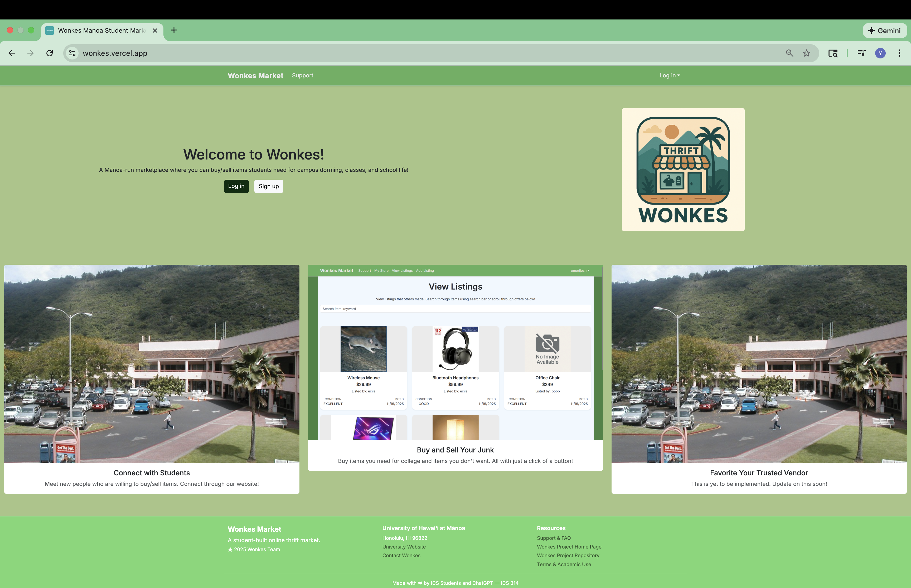

### Sign in and sign up

To sign in, click on the "Log in" button to log in. You can also login by clicking the "Log in" dropdown in the upper right corner of the navbar, then select "Log in."

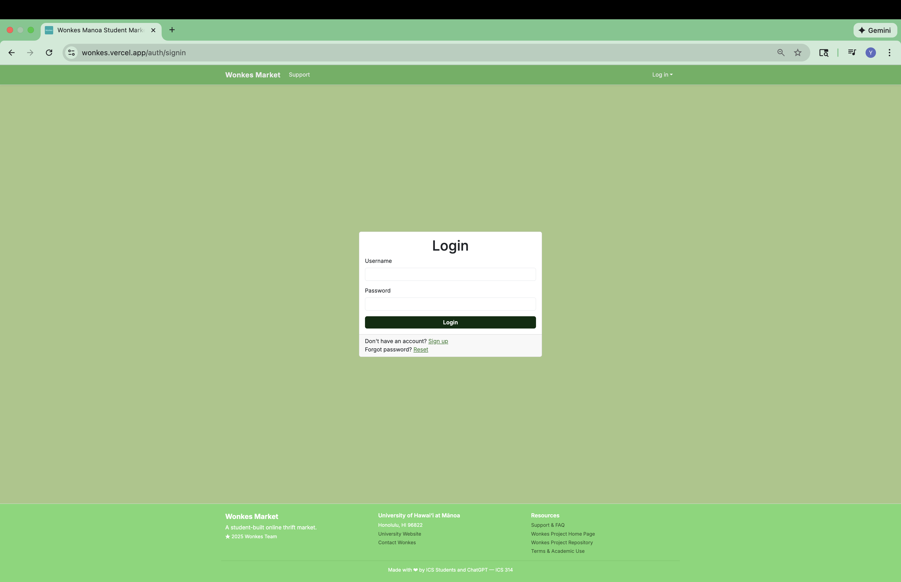

If you do not have an account yet, and want to sign up, click on the "Sign up" button instead. You can also login by clicking the "Log in" dropdown in the upper right corner of the navbar, then select "Sign up."

To sign up, you will provide an username, an UH email address (@hawaii.edu email address), a password, and your legal first and last name. Your username and email address can not repeat with other Wonkes Market users.

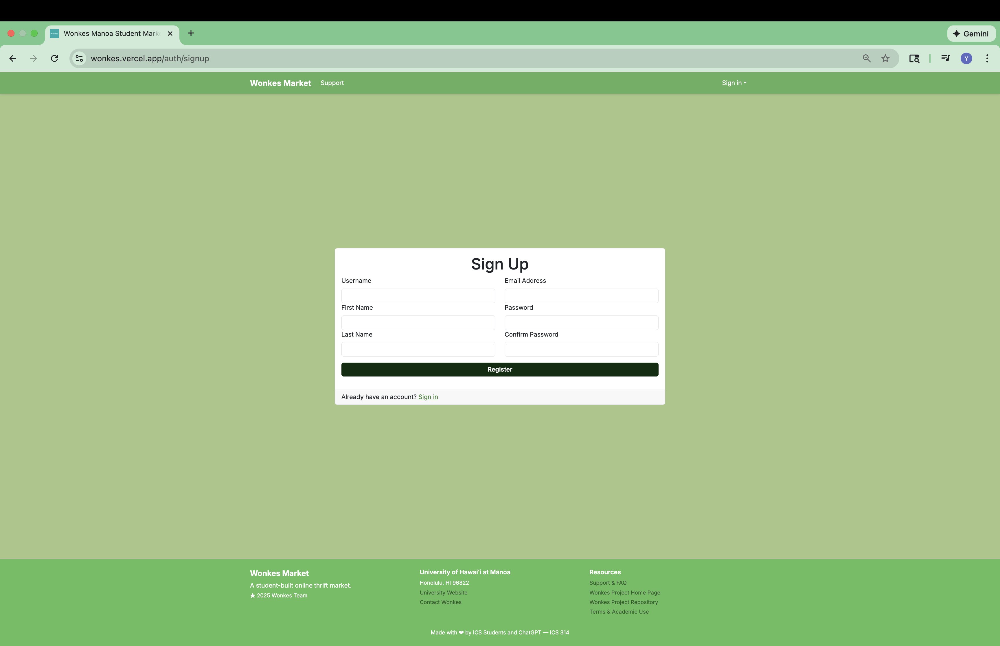

### View listings

After signing in, you can browse all items posted on Wonkes Market through the View Listings page. A item that is sold or recalled by the seller *will* appear on the listings (it is funny because this is an old bug that we are too lazy to resolve).

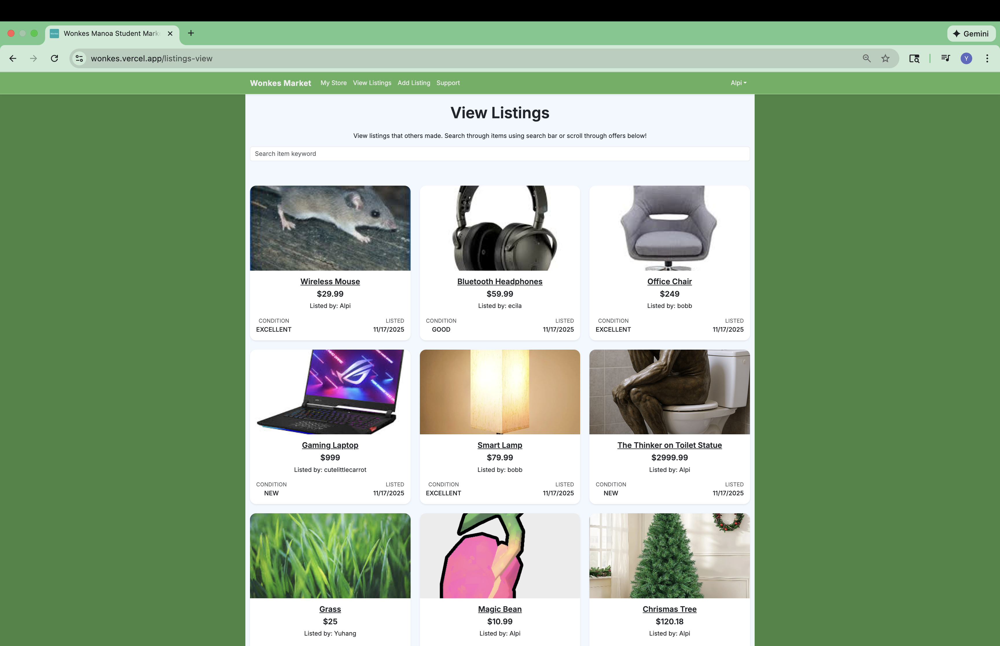

On the top of the page there is a search bar where you can use to easily find the item you need!

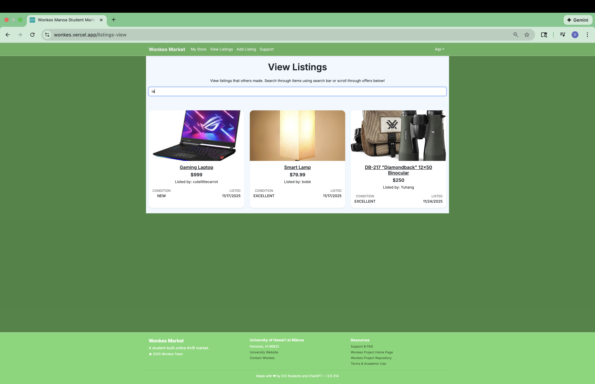

#### View item detail

When you click on an item, can view its details, which includes more photographs, full description, condition, and main material. Some sellers disclose dimensions and weight, too. You can click on small photo thumbnails to preview them. If you are interesting in purchase, you can get seller's contact by clicking on the "Get Seller's Contact" button. If you want to continue browsing, you can return to View Listings page by clicking on the "Return to Listings" button.

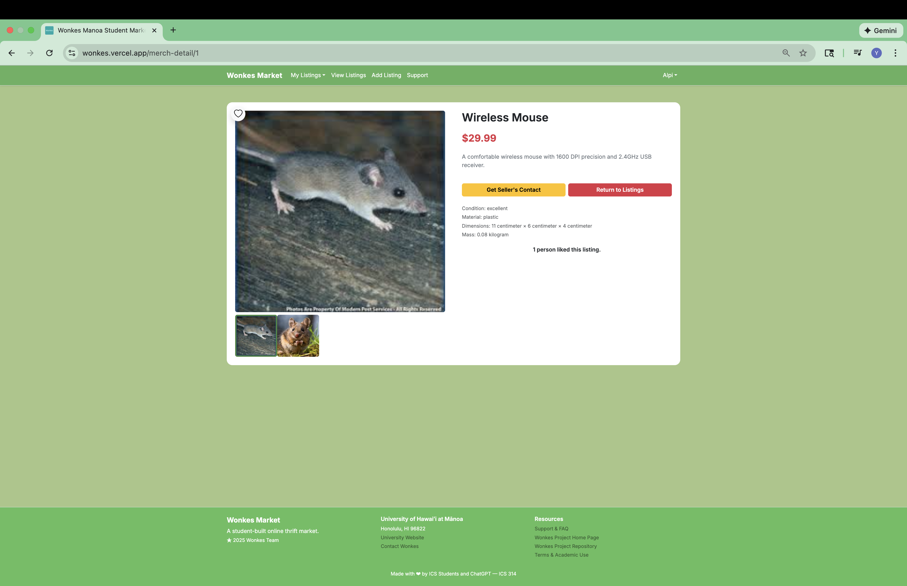

### Add a listing

A user not only can view existing listings, they can sell their item by creating a new listing. To do so, click on "Add Listing" on the top navigation bar, and tell us about your item.

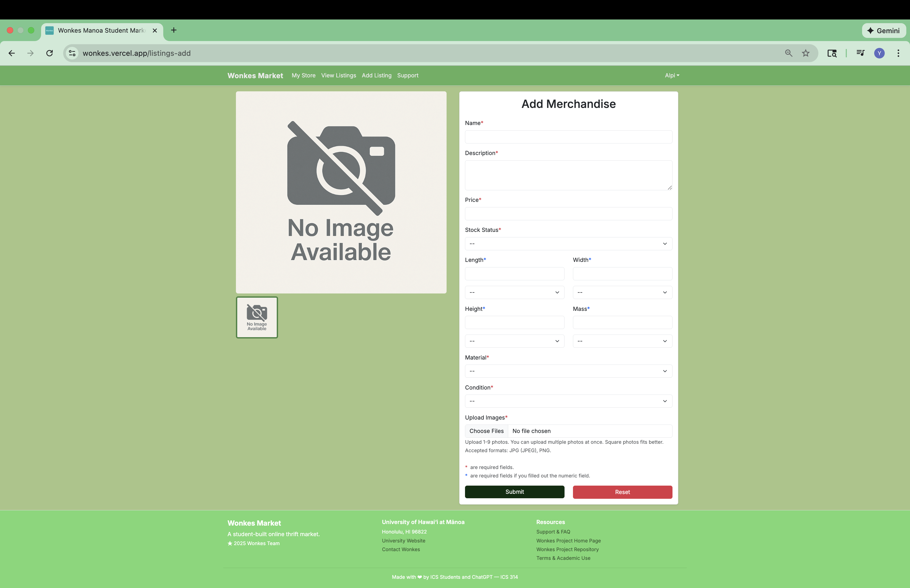

You are required to provide a name, a description, a price (in US dollars), main material, condition, and photographs of your item. You may optionally provide dimension and weight of your item. If you want to add an item, but don't want it appear right a way in the public listing, you can choose "Sold" or "Recalled" as your stock status, which will be the initial status of your item.

### The my store page

To see all items you added, click on "My Store" on the top navigation bar, and you will see what you have added, and the details of each of them.

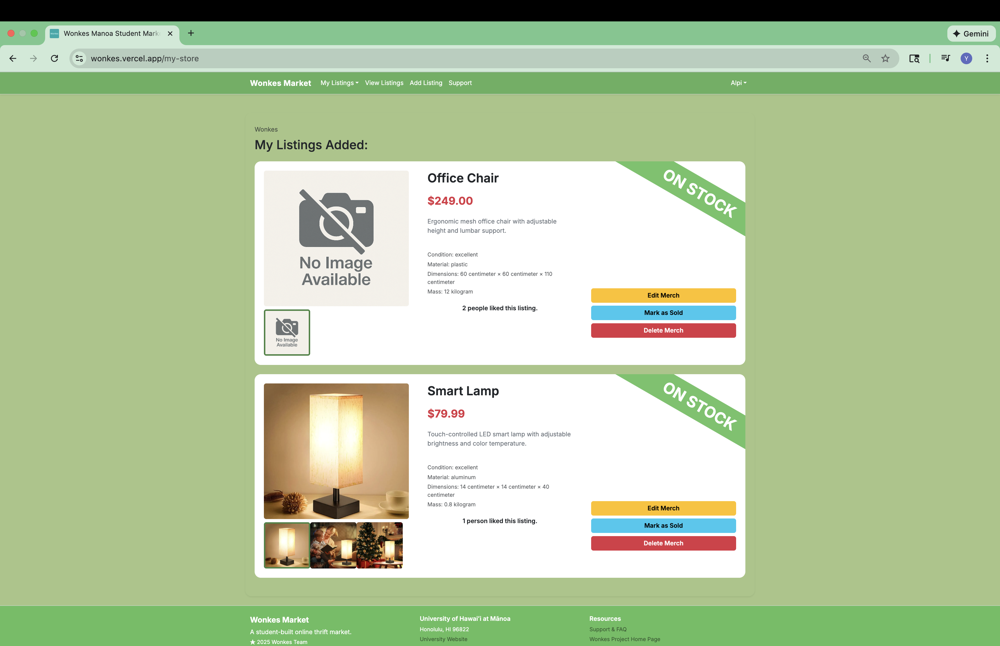

The badge at the top right corner of each slip tells you the current stock status of an item. You can click on the "Mark as Sold" button to conveniently change an item's stock status to sold, which make it no longer appear in the public listing.

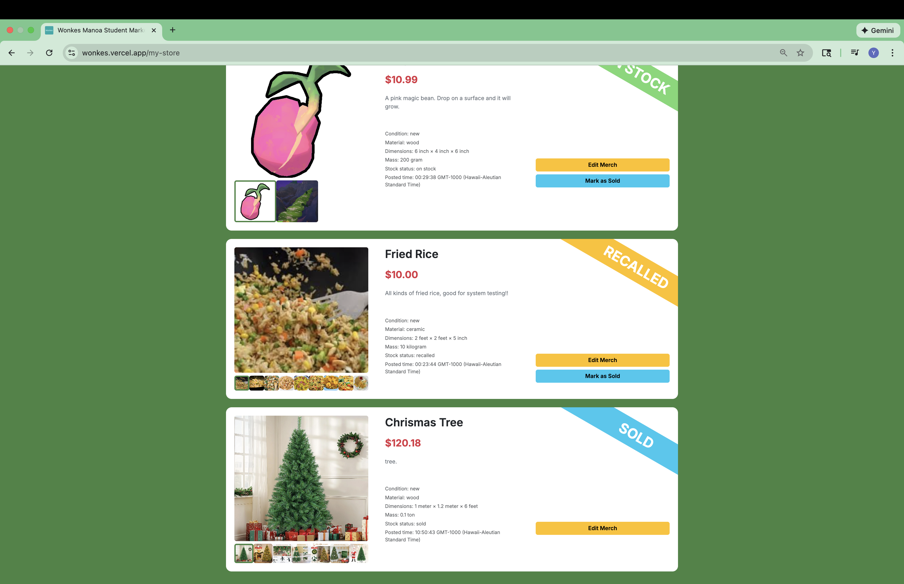

### Edit a listing

You can further edit an item by clicking on the "Edit Merch" button. You will be taken to the Edit Merch page, and be able to edit everything about your item: name, description, price, just to name a few.

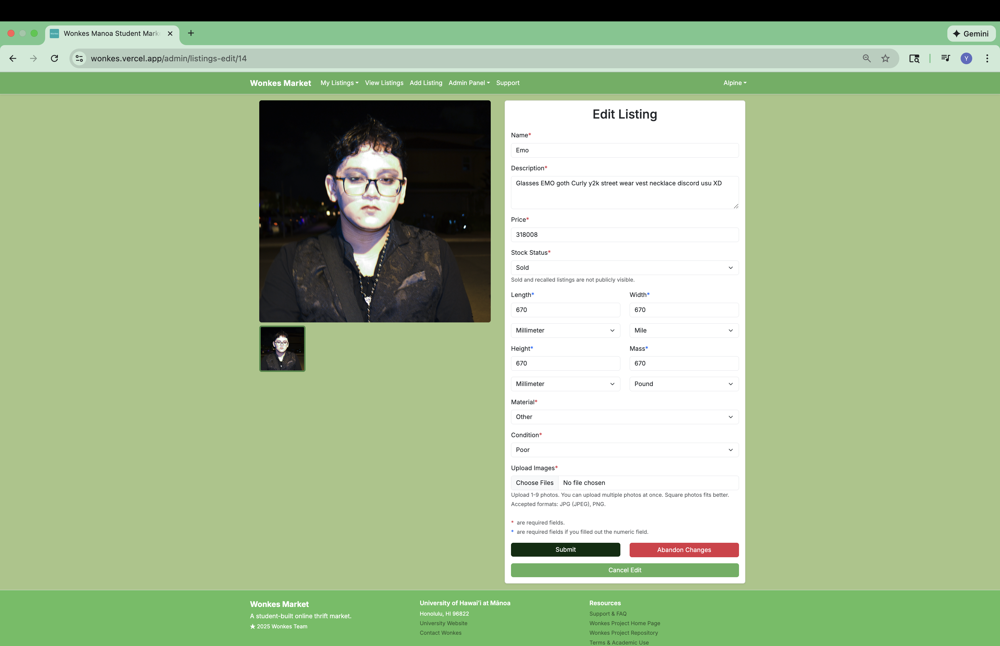

### Support page

The Support page explains our mission to create a convenient and sustainable platform for Manoa students.

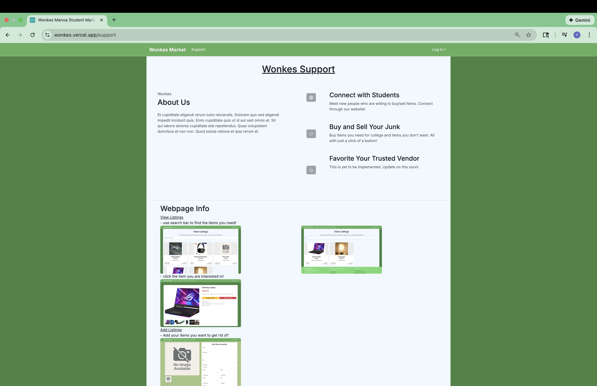

In the bottom of the Support page there is a FAQ section, where there is a list of frequently asked questions that you can click on for a quick answer. If you need more help, you can click on "here" or contact us with the contact information provided at the most bottom of the page.

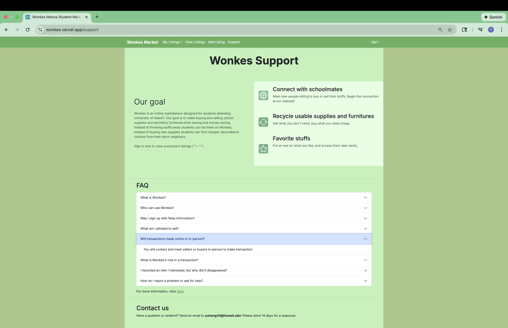

### 404 not found

If you navigate to an non-existence page on Wonkes Market, we have surprise for you:

### Coming soon

Wonkes Market has many pages still in development, but we can't wait to put on the links to these pages. If a page is still in development, the link that suppose to lead you to that page leads you here:

# Developer guide

### Install Wonkes Market

Hi, there! Let's walk you through how to download and run Wonkes Market on your dev site.

1. Go to [Wonkes' GitHub repository](https://github.com/wonkes-manoa/manoa-student-market).
2. Click on "Use this template" and then click on "Create a new repository." Give this repository a name of your choice.
3. Clone the repository to your local computer via GitHub Desktop.
4. Open the repository with Visual Studio Code.
5. In the directory of the repository, run `$ npm install` to install Node Package Manager (npm).
6. Then run `$ createdb wonkes` to create a database named `wonkes`.
7. Copy `sample.env` file to a new file called `.env`.
8. In the `.env` file, set `DATABASE_URL` to `postgresql://<username>:<password>@localhost:5432/wonkes?schema=public`.
9. Run `$ npx prisma migrate dev` to create tables in `wonkes` database.
10. Run `$ npx prisma db seed` to populate `wonkes` database with some default accounts and listings.
11. Run `$ npm run dev` and check out `http://localhost:3000` to view Wonkes Market on your dev site.

If you encounter any difficulties, feel guilt to contact us, as we are not professionals. Just joking, feel free to contact us :)

### Data model

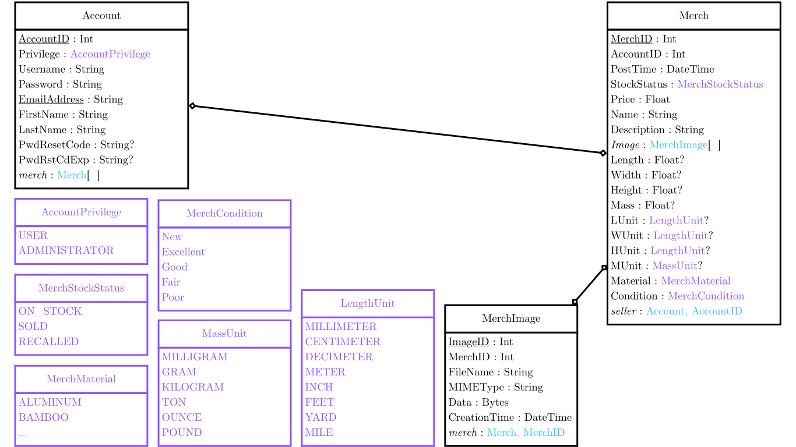

# Milestones

See how far are we right now!

### Milestone 1: basic functionality

The goal of Milestone 1 was to create the basic functionalities required for an user to sign in, browse listings, add listings, and contact a seller to initiate a transaction.

Milestone 1 was managed using [Wonkes GitHub Project Board M1](https://github.com/orgs/wonkes-manoa/projects/1):

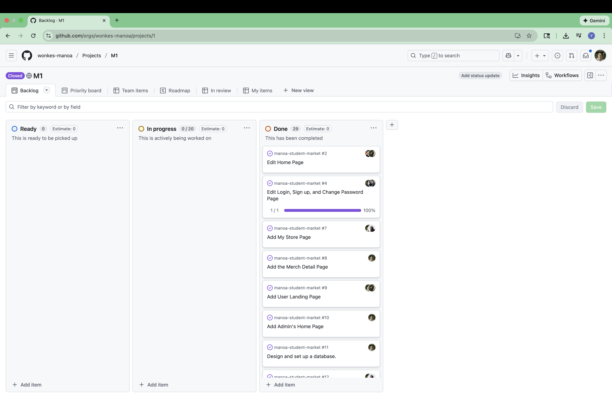

### Milestone 2: more functionality

The goal of Milestone 2 was to create more functionalities that advance the user experience, such as editing a listing, reseting password, adding a like system, and most importantly, faster loading speed of pages.

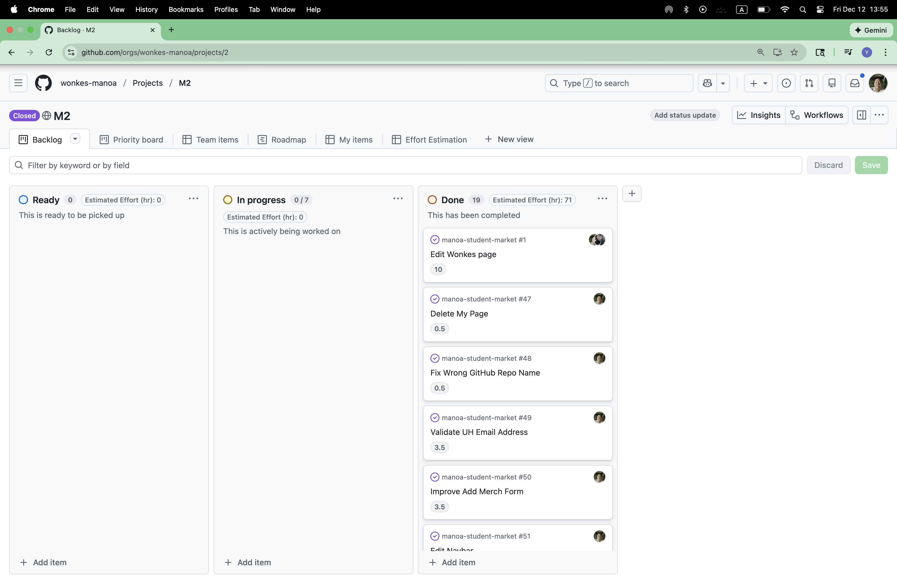

Milestone 2 was managed using [Wonkes GitHub Project Board M2](https://github.com/orgs/wonkes-manoa/projects/2):

### Milestone 3: better functionality

The goal of Milestone 3 is to fix existing bugs, add pagination, polish wording
in the website, and give admin functionality.

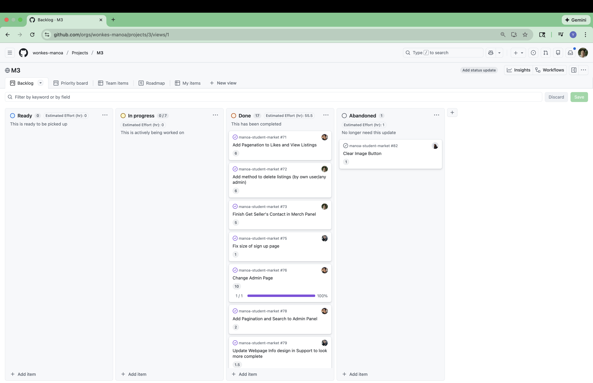

Milestone 3 was managed using [Wonkes GitHub Project Board M3](https://github.com/orgs/wonkes-manoa/projects/3):

# Community Feedback

An argument without evidence is not persuasive. Likewise, if we want to evaluate Wonkes Market honestly, we need to listen to the people who actually used it. We interviewed several Wonkes Market users from our community and they shared their honest thoughts and suggestions:

**Anonymous User 1:** "Interesting concept. I enjoyed the ease of signup. The UI could use some improvement. It feels too clunky. Maybe add variety to the top bar."

**Anonymous User 2:** "Not bad given the time allocated. Formatting could use a lot of work. UI irregularities are high."

**Fubuma's Mom:** "I think it's cute. It'll be a good way for students to socialize. Though, I'd add filters to narrow down the search."

**Fubuma's Dad:** "Fills a niche role, though I'm not too sure how many people would actually use this. It was simple to use, but sort of boring."

**Josh's Dog:** "Bark, bark! Bark, bark, bark!"

Alright… at first glance Wonkes Market look a little *doomed*. A boring idea, clunky UI, limited features, hopeless future potential, and we can't even gather 5 people for interview and have to ask a puppy for suggestions: all are evidence proving that Wonkes Market is flawed from top to bottom.

However, this is not the moment to declare Wonkes Market a misery. Hidden within the criticism are several meaningful strengths:

* Easy to use—simplicity was one of our core goals, and we did it
* Cute—if you believe it is the best thing on the world (⸝⸝> ᴗ•⸝⸝)
* Social potential—users see Wonkes as a platform that help students connect
* Fills a niche—there is a problem Wonkes solves, which means there is a potential audience

See? Wonkes have strengths too!

Besides compliments, suggestions are equally important. These suggestions give us clear direction on how Wonkes Market can improve.

* Improve clunky and inconsistent UI elements.
* Add filters to make searching more efficient.
* More engaging feature, and better product promotion.

If there were a Milestone 4, these would be our top priorities. Whether Wonkes survives the winter is uncertain—but at the very least, it has shown us what works, what doesn’t, and where growth is possible.

Overall, the community feedback highlights that Wonkes still has a long way to go: better UI design, more engaging features, and a clearer vision for its future. Even critical feedback helps us grow, and we genuinely appreciate our interviewees for taking the time to share their thoughts.

If there is a Milestone 4, we'd tackle these seriously, but Wonkes won't survive this winter.

Overall, the community feedback shows that Wonkes still has a long way to go: better UI design, more engaging features, and a clearer vision for its future. These quotes tells us where we are at right now, even critical feedback helps us grow, and we genuinely appreciate our interviewees for taking the time to share their thoughts.

# Our Team

Wonkes is designed, implemented, and maintained by [Andrew Narciso](https://annayep.github.io), [Brian Kim](https://Fuburian.github.io/), [Darilyn Evangelista](https://darilyne.github.io), [Joshua Omori](https://oomorijosh.github.io/), and [Yuhang Wu](https://mike-yuhang-wu.github.io).

Our [Team Contract](https://docs.google.com/document/d/1qroZlpwSoKRgaHdcHW84i6tGcFYL_FecpEvVHpQUUd8/edit?tab=t.0#heading=h.mobo0m5sq6vj).
