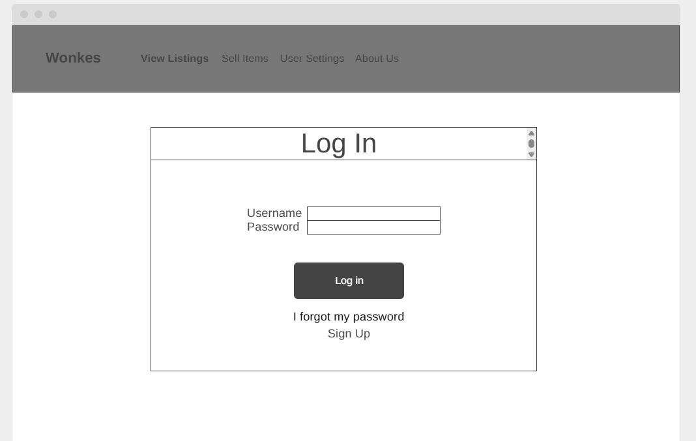
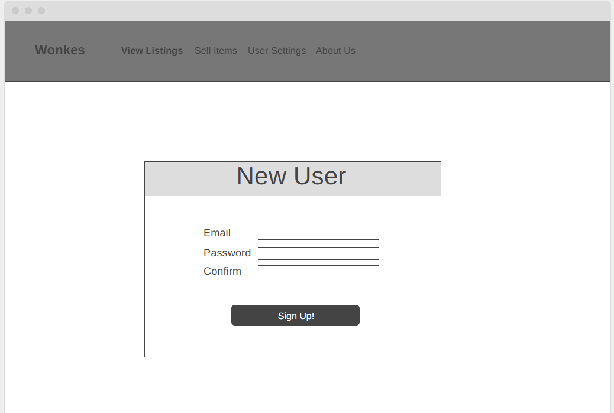
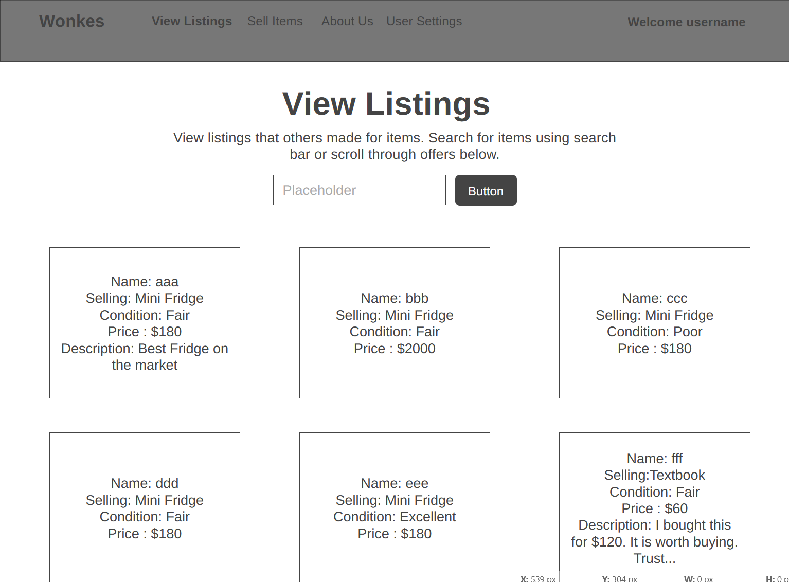
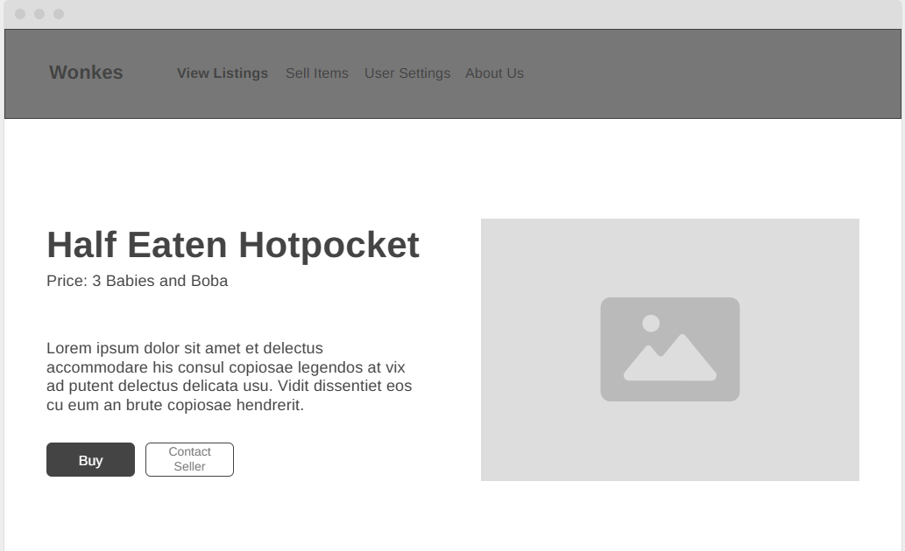
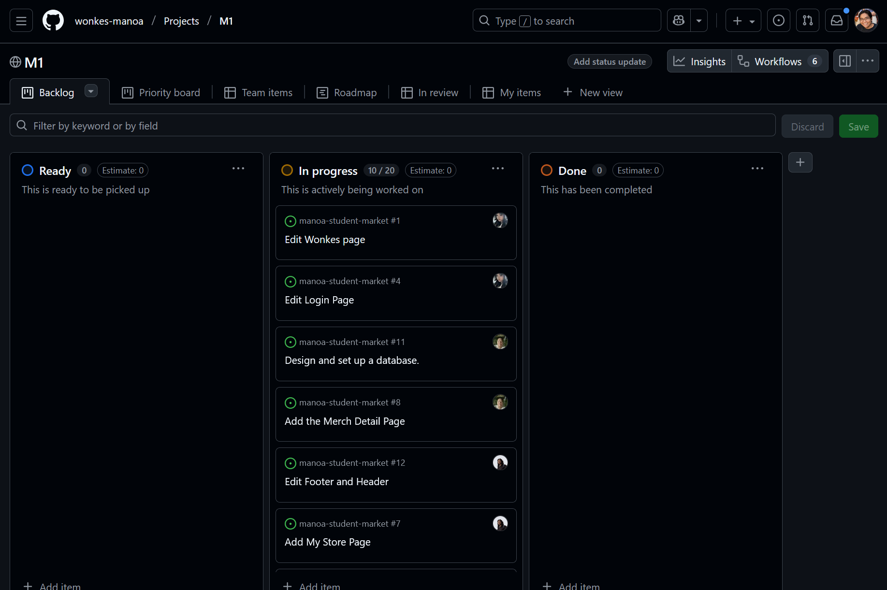

# Wonkes

# Table of contents

* [Overview](#overview)
* [User Guide](#user-guide)
* [Milestones](#milestones)
* [Our Team](#our-team)

# Overview

Wonkes is a web application that allows users to sell and buy items with just a click of a button. Users can create postings, browse for products, and connect with the community. It utilizes various technologies useful to web application creation, including:

* [React](https://reactjs.org/) for component-based UI implementation and routing.
* [React Bootstrap](https://react-bootstrap.github.io/) CSS Framework for UI design.
* [Vercel](https://vercel.com/) hosting service that deploys project online and hosts database.

With this tech stack, this is what we are implementing:

* A functioning landing page with listings, a user page, and a add listings page.
* Interface built with boostrap 5 for a responsive and multi-platform friendly design
* Initialization code to define users, listings, and category tags
* Use of bootstrap and typescript components to implement/manage a responsive layout with interactive elements
* A secure sign-up/sign-in page allowing the user permissions and access based on their role.
* Authorization examples: certain pages are public (View Listings, Login Page), while other pages require login (Admin Dashboard).

# User Guide

This section provides a walkthrough of the Wonkes user interface and its capabilities.

### Landing Page

The landing page is presented to users when they visit the top-level URL of the site.

### Sign in and sign up

Click on the "Sign In" button in the upper right corner of the navbar, to go to the following page and login. You must have been previously registered with the system to use this option:

Alternatively, you can select "Sign up" button to go to the following page and register as a new user:

### View Listings

Once logged in, Wonkes provides public pages that present the contents of the database organized in various ways.

The View Listings page allows users to easily view and filter all listing on the site:

### Viewing Items

When you click on a item, can view listing details, contact the seller, and place offers!

### About Us

The About Us page explains our mission to create a convenient and sustainable platform for Manoa students.

# Milestones

What we have accomplished so far!

### Milestone 1: Mockup development

The goal of Milestone 1 was to create a set of HTML pages providing a mockup of the pages in the system.

Milestone 1 was managed using [Wonkes GitHub Project Board M1](https://github.com/orgs/wonkes-manoa/projects/1):

### Milestone 2: TBA
<!-- Data model development-->

<!-- The goal of Milestone 2 was to implement the data model: the underlying set of Mongo Collections and the operations upon them that would support the BowFolio application.

Milestone 2 was managed using [BowFolio GitHub Project Board M2](https://github.com/Wonkes/Wonkes/projects/2):

 
--> 

TBA

### Milestone 3: TBA
<!--Final touches-->

<!-- The goal of Milestone 3 was to clean up the code base and fix minor UI issues.

Milestone 3 was managed using [BowFolio GitHub Project Board M3](https://github.com/Wonkes/Wonkes/projects/3):

As of the time of writing, this screenshot shows that there is an ongoing task (i.e. this writing). 
--> 

TBA

# Our Team

Wonkes is designed, implemented, and maintained by [Andrew Narciso](annayep.github.io), [Brian Kim](Fuburian.github.io/), [Darilyn Evangelista](darilyne.github.io), [Joshua Omori](oomorijosh.github.io/), and [Yuhang Wu](mike-yuhang-wu.github.io).

[Team Contract](https://docs.google.com/document/d/1qroZlpwSoKRgaHdcHW84i6tGcFYL_FecpEvVHpQUUd8/edit?tab=t.0#heading=h.mobo0m5sq6vj)

