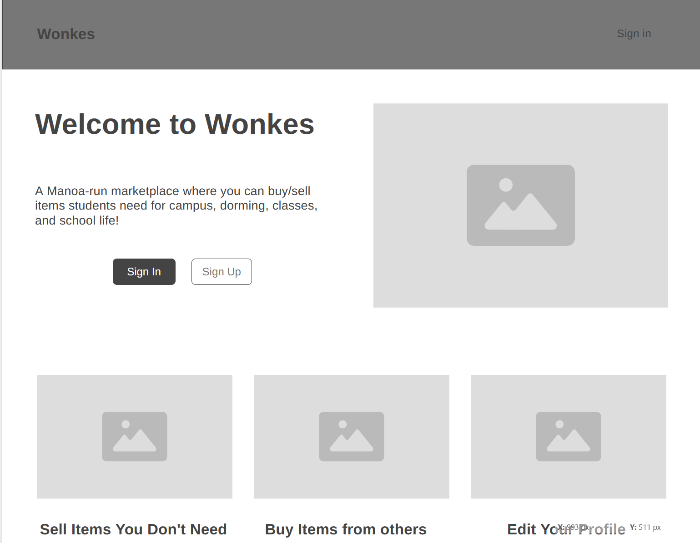
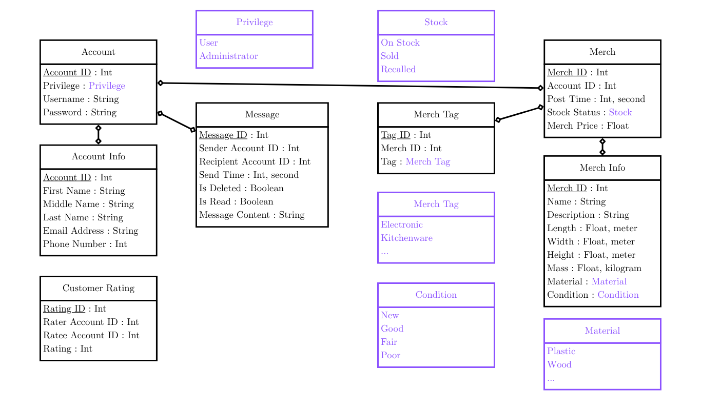

# Wonkes

## Table of contents

* [Overview](#overview)
* [Deployment](#deployment)
* [User Guide](#user-guide)
* [Community Feedback](#community-feedback)
* [Developer Guide](#developer-guide)
* [Development History](#development-history)
* [Continuous Integration](#continuous-integration)
* [Walkthrough videos](#walkthrough-videos)
* [Example enhancements](#example-enhancements)
* [Team](#team)

## Overview

Wonkes is an example web application that allows users to sell and buy items with just a click of a button. Users can create postings, browse for products, and connect with the community. It utilizes various technologies useful to ICS software engineering students, including:

* [React](https://reactjs.org/) for component-based UI implementation and routing.
* [React Bootstrap](https://react-bootstrap.github.io/) CSS Framework for UI design.
* [Vercel](https://vercel.com/) hosting service that deploys project online and hosts database.

It also provides code that implements a variety of useful design concepts, including:

* A functioning landing page with listings, a user page, and a add listings page.
* Interface built with boostrap 5 for a responsive and multi-platform friendly design
* Initialization code to define users, listings, and category tags
* Use of bootstrap and javascript components to implement/manage a responsive layout with interactive elements
* A secure sign-up/sign-in page allowing the user permissions and access based on their role.
* Authorization examples: certain pages are public (Add Listings, User Page), while other pages require login (Admin Dashboard).

## User Guide

This section provides a walkthrough of the Wonkes user interface and its capabilities.

### Landing Page

The landing page is presented to users when they visit the top-level URL to the site.



### Index pages (Projects, Profiles, Interests)

Wonkes provides three public pages that present the contents of the database organized in various ways.

The Profiles page shows all the current defined profiles and their associated Projects and Interests:


The Projects page shows all the currently defined Projects and their associated Profiles and Interests:


Finally, the Interests page shows all the currently defined Interests, and their associated Profiles and Projects:


### Sign in and sign up

Click on the "Login" button in the upper right corner of the navbar, then select "Sign in" to go to the following page and login. You must have been previously registered with the system to use this option:


Alternatively, you can select "Sign up" to go to the following page and register as a new user:


### Home page

After logging in, you are taken to the home page, which presents a form where you can complete and/or update your personal profile:


### Add Project page

Once you are logged in, you can define new projects with the Add Project page:


### Filter page

The Filter page provides the ability to query the database and display the results in the page. In this case, the query displays all of the Profiles that match one or more of the specified Interest(s).


## Community Feedback

We are interested in your experience using Bowfolio!  If you would like, please take a couple of minutes to fill out the [Wonkes Feedback Form](https://forms.gle/hBHdccQEbm4YNfPd6). It contains only five short questions and will help us understand how to improve the system.

## Developer Guide

This section provides information of interest to Meteor developers wishing to use this code base as a basis for their own development tasks.

### Installation

First, [install Meteor](https://www.meteor.com/install).

Second, visit the [Wonkes application github page](https://github.com/Wonkes/Wonkes), and click the "Use this template" button to create your own repository initialized with a copy of this application. Alternatively, you can download the sources as a zip file or make a fork of the repo.  However you do it, download a copy of the repo to your local computer.

Third, cd into the Wonkes/app directory and install libraries with:

```
$ meteor npm install
```

Fourth, run the system with:

```
$ meteor npm run start
```

If all goes well, the application will appear at [http://localhost:3000](http://localhost:3000).

### Application Design

Wonkes is based upon [meteor-application-template-react](https://ics-software-engineering.github.io/meteor-application-template-react/) and [meteor-example-form-react](https://ics-software-engineering.github.io/meteor-example-form-react/). Please use the videos and documentation at those sites to better acquaint yourself with the basic application design and form processing in Wonkes.

### Data model

As noted above, the Wonkes data model consists of three "primary" collections (Projects, Profiles, and Interests), as well as three "join" Collections (ProfilesProjects, ProfilesInterests, and ProjectsInterests).  To understand this design choice, consider the situation where you want to specify the projects associated with a Profile.

Design choice #1: Provide a field in Profile collection called "Projects", and fill it with an array of project names. This choice works great when you want to display a Profile and indicate the Projects it's associated with.  But what if you want to go the other direction: display a Project and all of the Profiles associated with it?  Then you have to do a sequential search through all of the Profiles, then do a sequential search through that array field looking for a match.  That's computationally expensive and also just silly.

Design choice #2:  Provide a "join" collection where each document contains two fields: Profile name and Project name. Each entry indicates that there is a relationship between those two entities. Now, to find all the Projects associated with a Profile, just search this collection for all the documents that match the Profile, then extract the Project field. Going the other way is just as easy: to find all the Profiles associated with a Project, just search the collection for all documents matching the Project, then extract the Profile field.

Wonkes implements Design choice #2 to provide pair-wise relations between all three of its primary collections:



The fields in boldface (Email for Profiles, and Name for Projects and Interests) indicate that those fields must have unique values so that they can be used as a primary key for that collection. This constraint is enforced in the schema definition associated with that collection.


## Initialization

The [config](https://github.com/Wonkes/Wonkes/tree/main/config) directory is intended to hold settings files.  The repository contains one file: [config/settings.development.json](https://github.com/Wonkes/Wonkes/blob/main/config/settings.development.json).

This file contains default definitions for Profiles, Projects, and Interests and the relationships between them. Consult the walkthrough video for more details.

The settings.development.json file contains a field called "loadAssetsFile". It is set to false, but if you change it to true, then the data in the file app/private/data.json will also be loaded.  The code to do this illustrates how to initialize a system when the initial data exceeds the size limitations for the settings file.


### Quality Assurance

#### ESLint

Wonkes includes a [.eslintrc](https://github.com/Wonkes/Wonkes/blob/main/app/.eslintrc) file to define the coding style adhered to in this application. You can invoke ESLint from the command line as follows:

```
meteor npm run lint
```

Here is sample output indicating that no ESLint errors were detected:

```
$ meteor npm run lint

> Wonkes@ lint /Users/philipjohnson/github/Wonkes/Wonkes/app
> eslint --quiet --ext .jsx --ext .js ./imports ./tests

$
```

ESLint should run without generating any errors.

It's significantly easier to do development with ESLint integrated directly into your IDE (such as IntelliJ).

#### End to End Testing

Wonkes uses [TestCafe](https://devexpress.github.io/testcafe/) to provide automated end-to-end testing.

The Wonkes end-to-end test code employs the page object model design pattern.  In the [Wonkes tests/ directory](https://github.com/Wonkes/Wonkes/tree/main/app/tests), the file [tests.testcafe.js](https://github.com/Wonkes/Wonkes/blob/main/app/tests/tests.testcafe.js) contains the TestCafe test definitions. The remaining files in the directory contain "page object models" for the various pages in the system (i.e. Home, Landing, Interests, etc.) as well as one component (navbar). This organization makes the test code shorter, easier to understand, and easier to debug.

To run the end-to-end tests in development mode, you must first start up a Wonkes instance by invoking `meteor npm run start` in one console window.

Then, in another console window, start up the end-to-end tests with:

```
meteor npm run testcafe
```

You will see browser windows appear and disappear as the tests run.  If the tests finish successfully, you should see the following in your second console window:

```
$ meteor npm run testcafe

> Wonkes@ testcafe /Users/philipjohnson/github/Wonkes/Wonkes/app
> testcafe chrome tests/*.testcafe.js

 Running tests in:
 - Chrome 86.0.4240.111 / macOS 10.15.7

 Wonkes localhost test with default db
 ✓ Test that landing page shows up
 ✓ Test that signin and signout work
 ✓ Test that signup page, then logout works
 ✓ Test that profiles page displays
 ✓ Test that interests page displays
 ✓ Test that projects page displays
 ✓ Test that home page display and profile modification works
 ✓ Test that addProject page works
 ✓ Test that filter page works


 9 passed (40s)

 $
```

You can also run the testcafe tests in "continuous integration mode".  This mode is appropriate when you want to run the tests using a continuous integration service like Jenkins, Semaphore, CircleCI, etc.  In this case, it is problematic to already have the server running in a separate console, and you cannot have the browser window appear and disappear.

To run the testcafe tests in continuous integration mode, first ensure that Wonkes is not running in any console.

Then, invoke `meteor npm run testcafe-ci`.  You will not see any windows appear.  When the tests finish, the console should look like this:

```
$ meteor npm run testcafe-ci

> Wonkes@ testcafe-ci /Users/philipjohnson/github/Wonkes/Wonkes/app
> testcafe chrome:headless tests/*.testcafe.js -q --app "meteor npm run start"

 Running tests in:
 - Chrome 86.0.4240.111 / macOS 10.15.7

 Wonkes localhost test with default db
 ✓ Test that landing page shows up (unstable)
 ✓ Test that signin and signout work
 ✓ Test that signup page, then logout works
 ✓ Test that profiles page displays
 ✓ Test that interests page displays
 ✓ Test that projects page displays
 ✓ Test that home page display and profile modification works
 ✓ Test that addProject page works
 ✓ Test that filter page works


 9 passed (56s)

$
```

All the tests pass, but the first test is marked as "unstable". At the time of writing, TestCafe fails the first time it tries to run a test in this mode, but subsequent attempts run normally. To prevent the test run from failing due to this problem with TestCafe, we enable [testcafe quarantine mode](https://devexpress.github.io/testcafe/documentation/guides/basic-guides/run-tests.html#quarantine-mode).

The only impact of quarantine mode should be that the first test is marked as "unstable".

## From mockup to production

Wonkes is meant to illustrate the use of Meteor for developing an initial proof-of-concept prototype.  For a production application, several additional security-related changes must be implemented:

* Use of email-based password specification for users, and/or use of an alternative authentication mechanism.
* Use of https so that passwords are sent in encrypted format.
* Removal of the insecure package, and the addition of Meteor Methods to replace client-side DB updates.

(Note that these changes do not need to be implemented for ICS 314, although they are relatively straightforward to accomplish.)

## Continuous Integration


Wonkes uses [GitHub Actions](https://docs.github.com/en/free-pro-team@latest/actions) to automatically run ESLint and TestCafe each time a commit is made to the default branch.  You can see the results of all recent "workflows" at [https://github.com/Wonkes/Wonkes/actions](https://github.com/Wonkes/Wonkes/actions).

The workflow definition file is quite simple and is located at
[.github/workflows/ci.yml](https://github.com/Wonkes/Wonkes/blob/main/.github/workflows/ci.yml).

## Development History

The development process for Wonkes conformed to [Issue Driven Project Management](http://courses.ics.hawaii.edu/ics314f19/modules/project-management/) practices. In a nutshell:

* Development consists of a sequence of Milestones.
* Each Milestone is specified as a set of tasks.
* Each task is described using a GitHub Issue, and is assigned to a single developer to complete.
* Tasks should typically consist of work that can be completed in 2-4 days.
* The work for each task is accomplished with a git branch named "issue-XX", where XX is replaced by the issue number.
* When a task is complete, its corresponding issue is closed and its corresponding git branch is merged into master.
* The state (todo, in progress, complete) of each task for a milestone is managed using a GitHub Project Board.

The following sections document the development history of Wonkes.

### Milestone 1: Mockup development

TBA

### Milestone 2: Data model development

TBA

## Milestone 3: Final touches

TBA


## Team

Wonkes is designed, implemented, and maintained by [Philip Johnson](https://philipmjohnson.org) and [Cam Moore](https://cammoore.github.io/).
